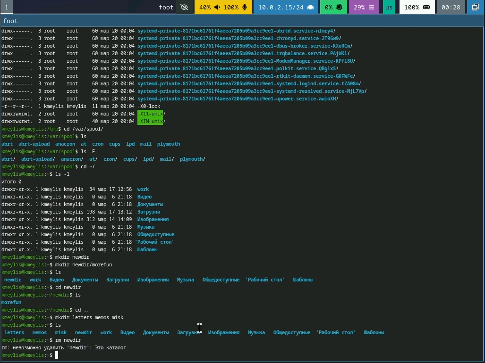
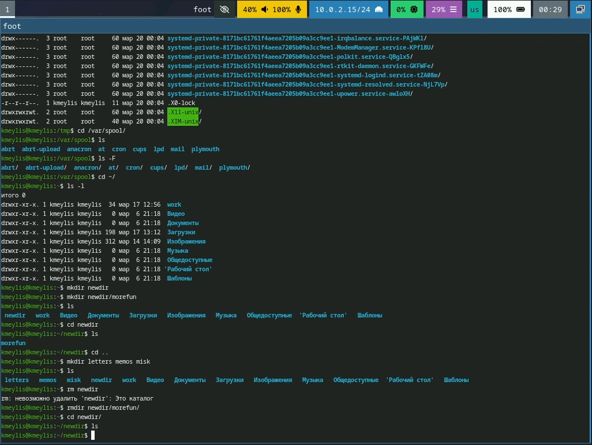
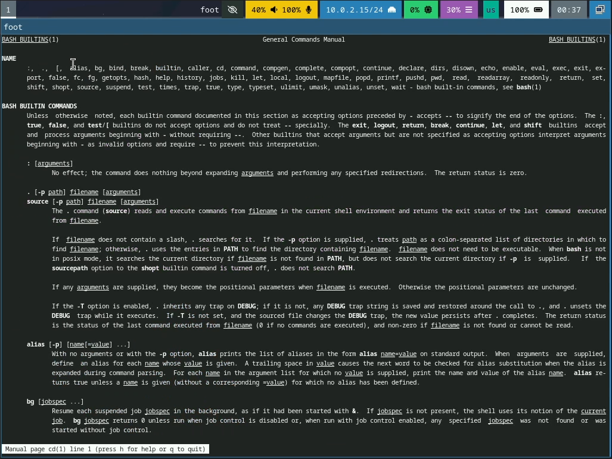
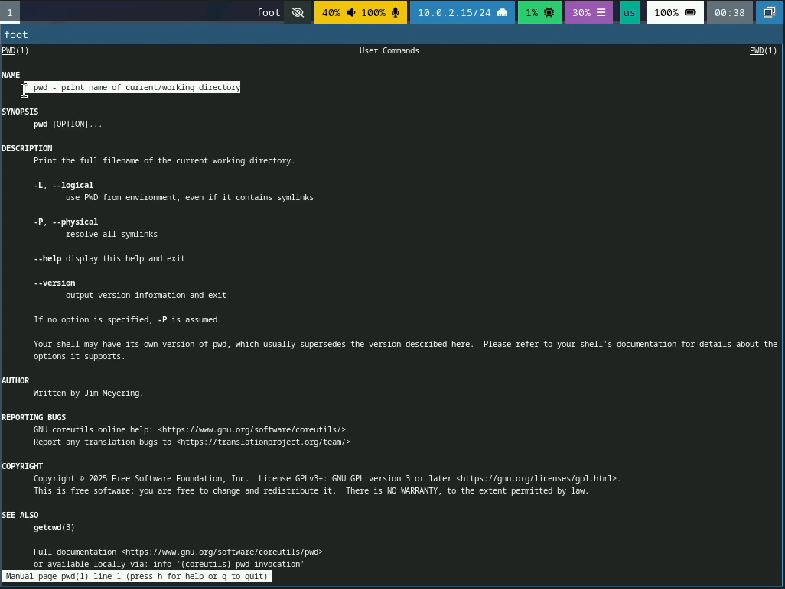
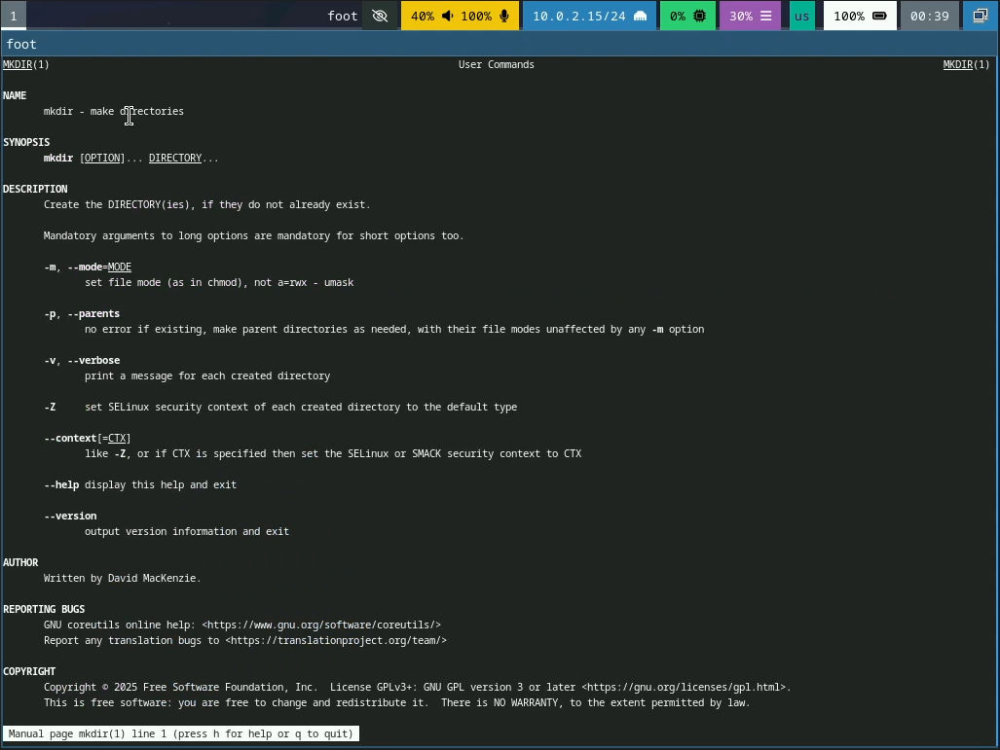
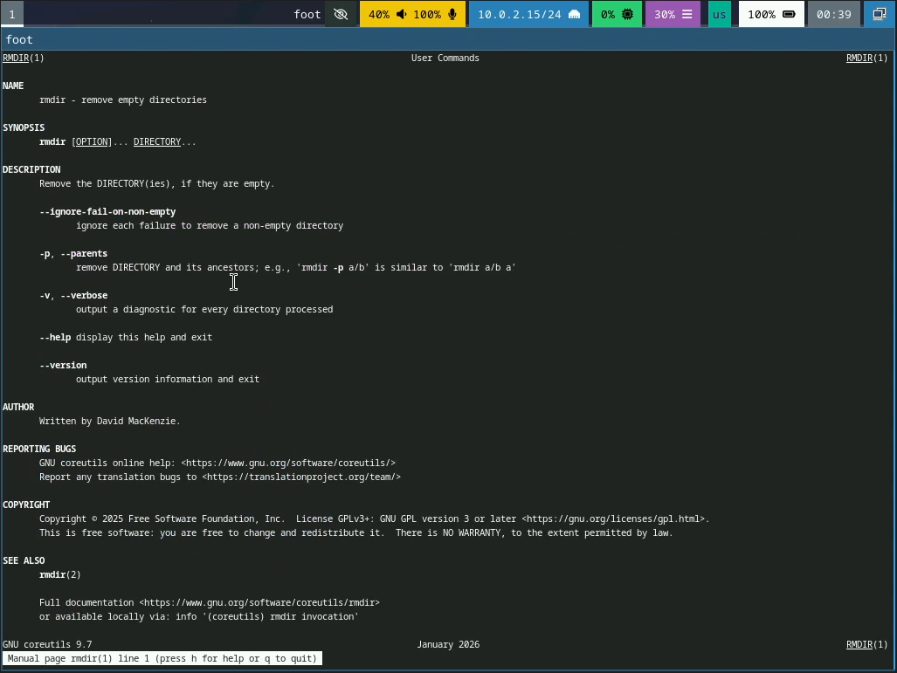
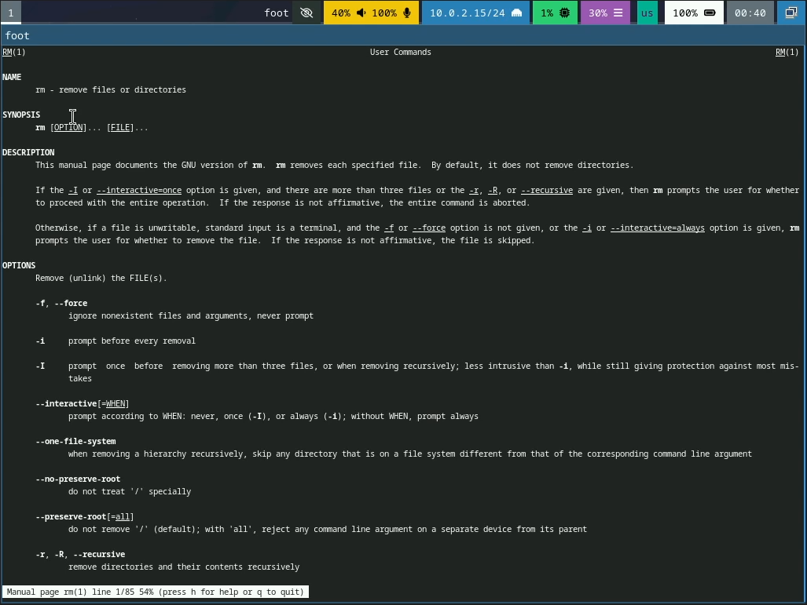
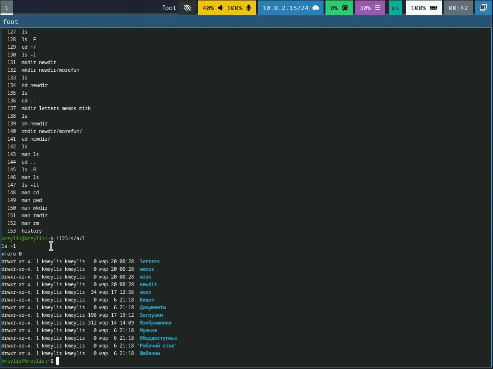

---
## Author
author:
  name: Кадыров Мейлис
  email: 1032254373@rudn.ru
  affiliation:
    - name: Российский университет дружбы народов
      country: Российская Федерация
      postal-code: 117198
      city: Москва
      address: ул. Миклухо-Маклая, д. 6
## Title
title: Презентация Лабараторной работы №6
subtitle: Основы интерфейса взаимодействия пользователя с системой Unix на уровне командной строки
license: CC BY
date: today
date-format: "YYYY-MM-DD" # Example: 2025-09-06
---

# Информация

## Докладчик

:::::::::::::: {.columns align=center}
::: {.column width="70%"}

  * Кадыров Мейлис
  * Студент Балавриата ФМиЕН НКАбд-03-25
  * Российский университет дружбы народов им. П. Лумумбы
  * [1032254373@rudn.ru](mailto:1032254373@rudn.ru)

:::
::: {.column width="30%"}

:::
::::::::::::::

# Цели и задачи

## Цель лабараторной работы 
- Приобретение практических навыков взаимодействия пользователя с системой посредством командной строки.

## Задачи

1. Определите полное имя вашего домашнего каталога. Далее относительно этого ката-
лога будут выполняться последующие упражнения.
2. Выполните следующие действия:
2.1. Перейдите в каталог /tmp.
2.2. Выведите на экран содержимое каталога /tmp. Для этого используйте команду ls
с различными опциями. Поясните разницу в выводимой на экран информации.
2.3. Определите, есть ли в каталоге /var/spool подкаталог с именем cron?
2.4. Перейдите в Ваш домашний каталог и выведите на экран его содержимое. Опре-
делите, кто является владельцем файлов и подкаталогов?
3. Выполните следующие действия:
3.1. В домашнем каталоге создайте новый каталог с именем newdir.
3.2. В каталоге ~/newdir создайте новый каталог с именем morefun.
3.3. В домашнем каталоге создайте одной командой три новых каталога с именами
letters, memos, misk. Затем удалите эти каталоги одной командой.
3.4. Попробуйте удалить ранее созданный каталог ~/newdir командой rm. Проверьте,
был ли каталог удалён.
3.5. Удалите каталог ~/newdir/morefun из домашнего каталога. Проверьте, был ли
каталог удалён.

##

4. С помощью команды man определите, какую опцию команды ls нужно использо-
вать для просмотра содержимое не только указанного каталога, но и подкаталогов,
входящих в него.
5. С помощью команды man определите набор опций команды ls, позволяющий отсорти-
ровать по времени последнего изменения выводимый список содержимого каталога
с развёрнутым описанием файлов.
6. Используйте команду man для просмотра описания следующих команд: cd, pwd, mkdir,
rmdir, rm. Поясните основные опции этих команд.
7. Используя информацию, полученную при помощи команды history, выполните мо-
дификацию и исполнение нескольких команд из буфера команд.

# Выполнение Лабараторной работы

## Определение имени домашнего каталога 

{#fig:001 width=70%}

## Переход в котолог /tmp и выполнение команды ls с различными опциями

{#fig:002 width=70%}

## Переход в каталог /var/spool, поиск подкотолога cron в результате ввода ls

{#fig:003 width=70%}

##  Переход в домашний каталог и вывод на экран его содержимого.

{#fig:004 width=70%}

## Создание различных котологов и работа с ними

{#fig:005 width=70%}

##

{#fig:006 width=70%}

##

{#fig:007 width=70%}

##

{#fig:008 width=70%}

## Поимк опций -R -lt для ls 

{#fig:009 width=70%}

## Используем команду man для просмотра описания следующих команд: cd, pwd, mkdir,rmdir, rm.

{#fig:010 width=70%}

##

{#fig:0011 width=70%}

##

{#fig:012 width=70%}

##

{#fig:013 width=70%}

##

{#fig:014 width=70%}

## Использование history

{#fig:015 width=70%}

# Вывод 

- Мы приобрели практические навыки использования командной строки в LINUX
