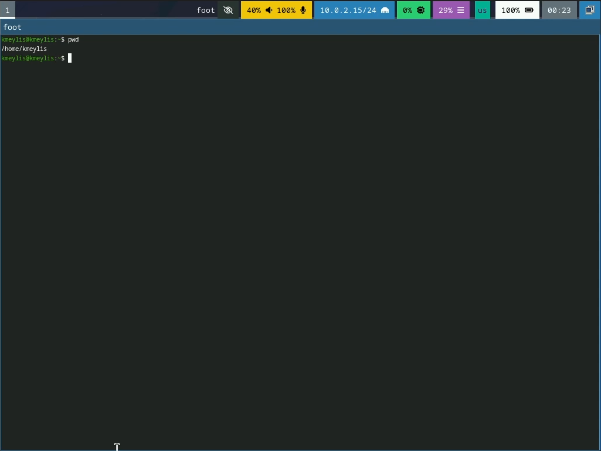
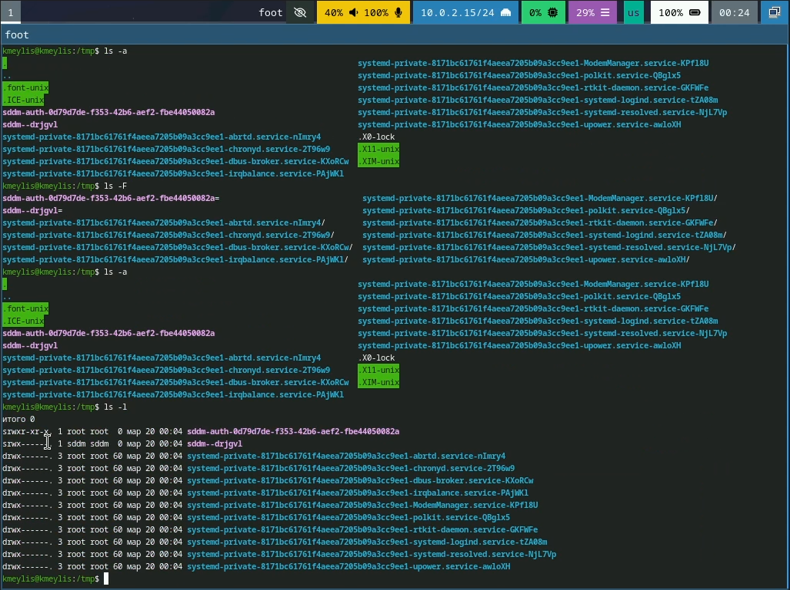
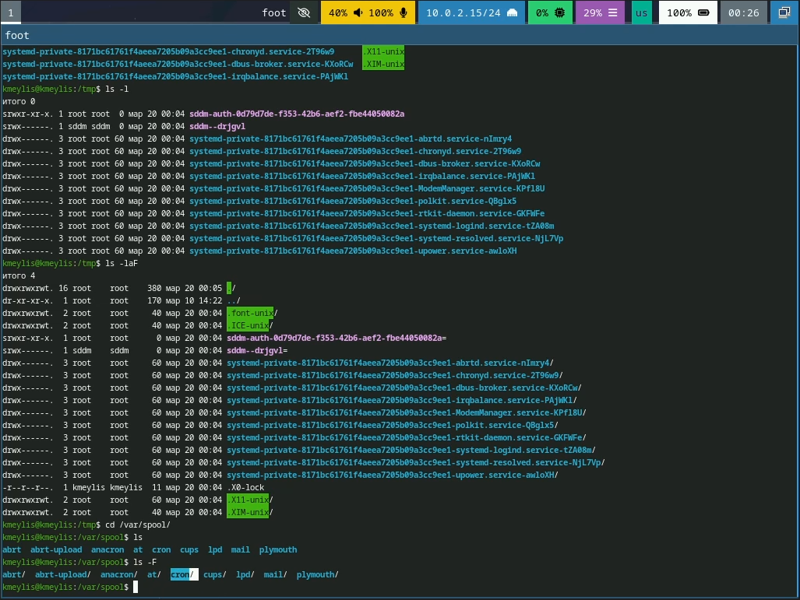
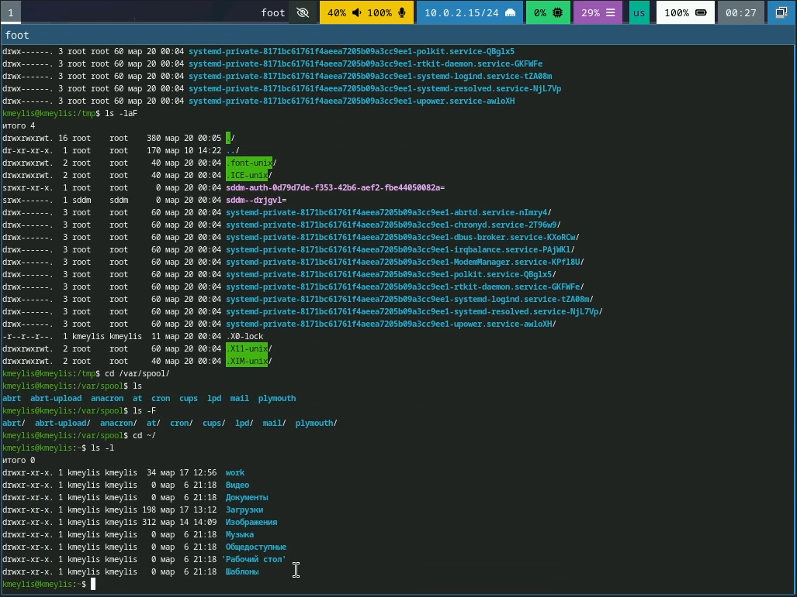
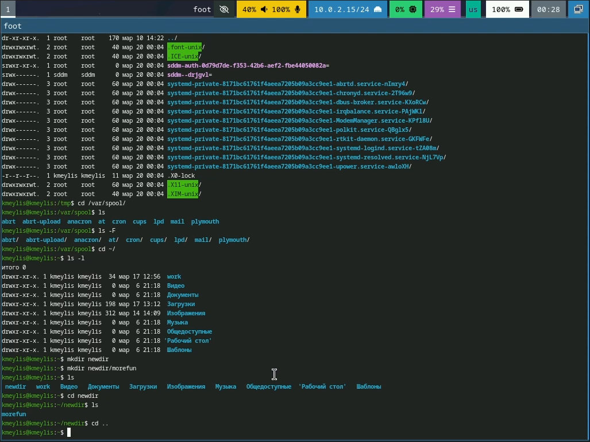
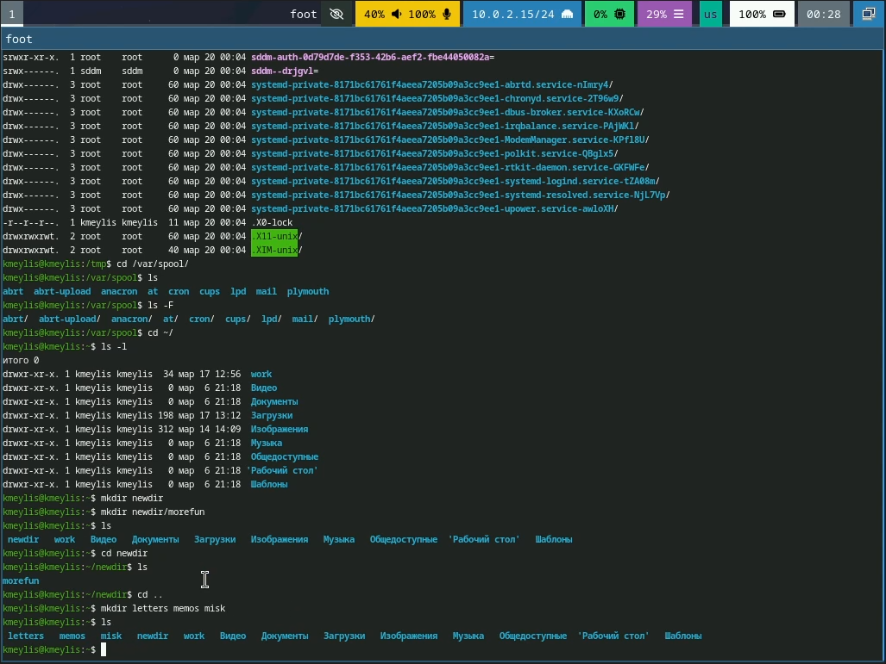

---
## Front matter
title: "Отчёт по лабораторной работе №6"
subtitle: "Основы интерфейса командной строки"
author: "Кадыров Мейлис"
email: "1032254373@rudn.ru"

## Generic otions
lang: ru-RU
toc-title: "Содержание"

## Bibliography
bibliography: bib/cite.bib
csl: _resources/csl/gost-r-7-0-5-2008-numeric.csl

## Pdf output format
toc: true # Table of contents
toc-depth: 2
lof: true # List of figures
lot: true # List of tables
fontsize: 12pt
linestretch: 1.5
papersize: a4
documentclass: scrreprt
## I18n polyglossia
polyglossia-lang:
  name: russian
  options:
  - spelling=modern
  - babelshorthands=true
polyglossia-otherlangs:
  name: english
## I18n babel
babel-lang: russian
babel-otherlangs: english

biblatex: true
biblio-style: "gost-numeric"
biblatexoptions:
  - parentracker=true
  - backend=biber
  - hyperref=auto
  - language=auto
  - autolang=other*
  - citestyle=gost-numeric
## Pandoc-crossref LaTeX customization
figureTitle: "Рис."
tableTitle: "Таблица"
listingTitle: "Листинг"
lofTitle: "Список иллюстраций"
lotTitle: "Список таблиц"
lolTitle: "Листинги"
## Misc options
indent: true
header-includes:
  - \usepackage{indentfirst}
  - \usepackage{float} # keep figures where there are in the text
  - \floatplacement{figure}{H} # keep figures where there are in the text
---

# Цель работы

Приобретение практических навыков взаимодействия пользователя с системой по-
средством командной строки.

# Задание

1. Определите полное имя вашего домашнего каталога. Далее относительно этого ката-
лога будут выполняться последующие упражнения.
2. Выполните следующие действия:
2.1. Перейдите в каталог /tmp.
2.2. Выведите на экран содержимое каталога /tmp. Для этого используйте команду ls
с различными опциями. Поясните разницу в выводимой на экран информации.
2.3. Определите, есть ли в каталоге /var/spool подкаталог с именем cron?
2.4. Перейдите в Ваш домашний каталог и выведите на экран его содержимое. Опре-
делите, кто является владельцем файлов и подкаталогов?
3. Выполните следующие действия:
3.1. В домашнем каталоге создайте новый каталог с именем newdir.
3.2. В каталоге ~/newdir создайте новый каталог с именем morefun.
3.3. В домашнем каталоге создайте одной командой три новых каталога с именами
letters, memos, misk. Затем удалите эти каталоги одной командой.
3.4. Попробуйте удалить ранее созданный каталог ~/newdir командой rm. Проверьте,
был ли каталог удалён.
3.5. Удалите каталог ~/newdir/morefun из домашнего каталога. Проверьте, был ли
каталог удалён.
4. С помощью команды man определите, какую опцию команды ls нужно использо-
вать для просмотра содержимое не только указанного каталога, но и подкаталогов,
входящих в него.
5. С помощью команды man определите набор опций команды ls, позволяющий отсорти-
ровать по времени последнего изменения выводимый список содержимого каталога
с развёрнутым описанием файлов.
6. Используйте команду man для просмотра описания следующих команд: cd, pwd, mkdir,
rmdir, rm. Поясните основные опции этих команд.
7. Используя информацию, полученную при помощи команды history, выполните мо-
дификацию и исполнение нескольких команд из буфера команд.

# Теоретическое введение

|Команда |Функция команды                                                      |
|--------|---------------------------------------------------------------------|
|pwd     | Выводит полный путь к котологу в котором мы работаем                |
|ls      | Выводит список подкотологов и файлов находящихся в рабочем котологе |
|mkdir   | Создает котолог/подкотолог                                          |
|rm      | Удаляет файлы и котологи                                            |
|rmdir   | Удаляет исключительно котологи                                      |
|history | показывает историю команд                                           |

# Выполнение лабораторной работы

## 1. Определение полного имени домашнего каталога

Для того чтобы узнать абсолютный путь к домашнему каталогу, используется команда `pwd`. На скриншоте видно, что домашний каталог пользователя имеет путь `/home/kmeylis`.([рис. @fig-001]).

{#fig:001 width=70%}

## 2. Работа с каталогом /tmp

2.1. С помощью команды `cd /tmp` был осуществлён переход в каталог временных файлов.([рис @fig:002])

(#fig:002 width=70%)

2.2. Для просмотра содержимого используется команда `ls`.([рис @fig:003])

(#fig:003 width=70%)

- **`ls -l`** - выводит детальную информацию о файлах и каталогах: права доступа, владелец, размер, дата изменения и имя.
- **`ls -a`** - показывает все файлы, включая скрытые (начинающиеся с точки).
- **`ls -F`** - добавляет к именам файлов символы, указывающие на их тип: `/` для каталогов, `*` для исполняемых файлов, `@` для символических ссылок.

2.3. Для просмотра содержимого каталога `/var/spool` `ls`. .([рис @fig:004])

(#fig:004 width=70%)

2.4. Возврат в домашний каталог выполнен командой `cd ~/`. Подробный список содержимого получен с помощью `ls -l` . Видно, что владельцем всех файлов и подкаталогов является пользователь `kmeylis`..([рис @fig:005])

(#fig:005 width=70%)

## 3. Создание и удаление каталогов

3.1. Команда `mkdir newdir` создала новый каталог..([рис @fig:006])

(#fig:006 width=70%)

3.2. С помощью команды `mkdir newdir/morefun` создан подкаталог. .([рис @fig:007])

(#fig:007 width=70%)

3.3. Команда `mkdir letters memos misk` создаёт три каталога..([рис @fig:008])

(#fig:008 width=70%)

3.4. Команда `rm newdir` выдаёт ошибку, так как `rm` без опций удаляет только файлы, а не каталоги. На рис. 9 показано сообщение об ошибке, и каталог `newdir` остаётся на месте..([рис @fig:009])

(#fig:009 width=70%)

3.5. Удаляем `morefun` командой `rmdir newdir/morefun` (пустой подкаталог). Затем переходим в `newdir` (`cd newdir`), проверяем, что он пуст (`ls`)..([рис @fig:010])

(#fig:010 width=70%)

## 4. Команда man

С помощью команды man определим, какую опцию команды ls нужно использовать для просмотра содержимое не только указанного каталога, но и подката- логов, входящих в него. Введя в консоли man ls Мы получим справку на английском языке и в ней нужный нам ключ к команде. Это ключ -R..([рис @fig:011])

(#fig:011 width=70%)

## 5. Сортировка списка файлов по времени изменения

Для сортировки содержимого каталога по времени последнего изменения используется комбинация опций `-lt` (сортировка по времени, подробный формат). .([рис @fig:012])

(#fig:012 width=70%)

## 6. Изучение справочной информации о командах

Для получения справки о командах используется `man`.([рис @fig:013])

(#fig:013 width=70%)

## 7. Работа с историей команд

Команда `history` выводит список ранее выполненных команд. Показан пример модификации команды из истории: строка с номером 123 (`ls -a`) изменена на `ls -l` с помощью конструкции `123:s/-a/-l/`. .([рис @fig:014])

(#fig:014 width=70%)

# Выводы

Здесь кратко описываются итоги проделанной работы.

# Контрольные Вопросы

1. Что такое командная строка?
Ответ: текстовый интерфейс взаимодействия пользователя с системой

2. При помощи какой команды можно определить абсолютный путь текущего каталога? Приведите пример.
Ответ: команда pwd
Пример:
+ cd /var/www
+ pwd
+ /var/www/

3. При помощи какой команды и каких опций можно определить только тип файлов и их имена в текущем каталоге? Приведите примеры. 
Ответ: команда ls с опцией -F.

4. Каким образом отобразить информацию о скрытых файлах? Приведите примерыю. 
Ответ: ls -a — показывает все файлы, включая скрытые (начинающиеся с точки). 
Пример: ls -a → .bashrc .profile.
 
5. При помощи каких команд можно удалить файл и каталог? Можно ли это сделать одной и той же командой? 
Ответ: С помощью команды rm можно удалить как отдельный файл так и целый каталог, в случае каталога необходимо указать опцию -r.

6.  Каким образом можно вывести информацию о последних выполненных пользователем командах? работы? 
Ответ: команда history — выводит список последних выполненных команд.

7. Как воспользоваться историей команд для их модифицированного выполнения? Приведите примеры. 
Ответ: Модификация команды из истории: !номер:s/старое/новое/. Пример: !3:s/ls/ll/ заменит в команде №3 "ls" на "ll" и выполнит.

8. Приведите примеры запуска нескольких команд в одной строке. 
Ответ: Несколько команд в строке: через ; (последовательно) или && (при успехе). 
Пример: cd /tmp; ls -l.

9. Дайте определение и приведите примера символов экранирования. 
Ответ: Экранирование — отмена специального значения символа с помощью \. 
Пример: echo \$HOME выведет $HOME, а не значение переменной.

10.  Охарактеризуйте вывод информации на экран после выполнения команды ls с опцией. 
Ответ: ls -l выводит: тип файла, права доступа, число ссылок, владельца, группу, размер, дату, имя. 
Пример: -rw-r--r-- 1 user group 1024 Mar 13 10:00 file.txt.

11.  Что такое относительный путь к файлу? Приведите примеры использования относительного и абсолютного пути при выполнении какой-либо команды.
 Ответ: относительный путь - путь к тому или иному файлу или директории относительной текущей рабочей директории 
Пример: папка /www/ в директории /var/ абсолютный путь: /var/www/ относительный путь(если рабочая директория - /var/): /www/

12.  Как получить информацию об интересующей вас команде? 
Ответ: можно попробовать найти информацию по использованию с помощью утилиты man, или попробовать ввести опцию --help.

13.  Какая клавиша или комбинация клавиш служит для автоматического дополнения вводимых команд? 
Ответ: клавиша Tab.

# Список литературы{.unnumbered}

::: {#refs}
:::
